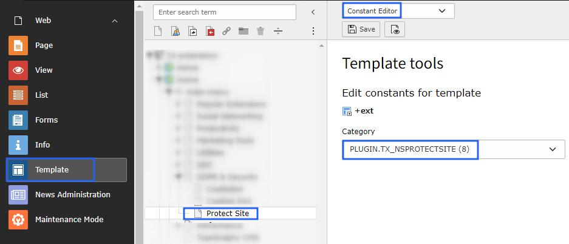
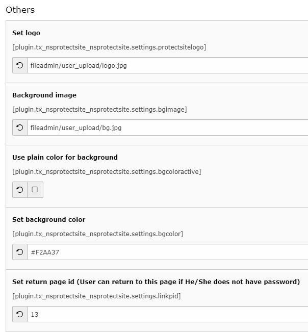
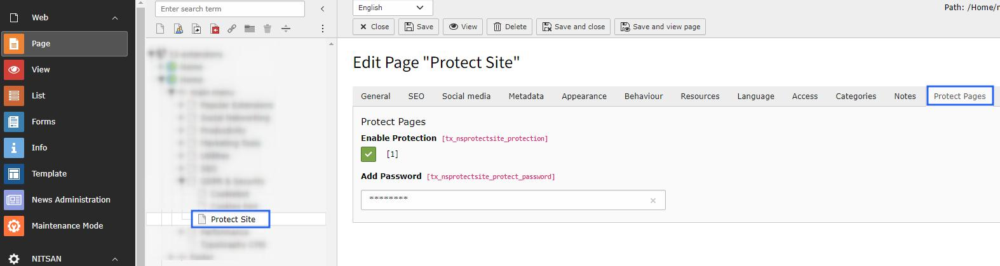

=============
Configuration
=============

Configure how protected page will look like
===========================================

First of all, let's configure how any protected page will look to visitor. Please perform following steps:

- Step 1: Go to Template.

- Step 2: Select root page.

- Step 3: Select Constant Editor from drop-down.

- Step 3: Select Constant Editor > PLUGIN.TX_NSPROTECTSITE.

Once extension is selected set all the possible configuration for the Protected page. Please check following image for the available configurations.

- **Set Logo:** Set the logo you want to display on Protected page. Generally, it is site's logo.

- **Background image:** Set the background image to display. This will work only if "Use plain color for background" is turned off.

- **Use plain color for background:** Enable/Disable Plain color as background

- **Set background color:** Set Hex code for color to use in background

- **Set return page id:** Set page ID where user can return to if He/She does not have password.

Add protection to the specific webpage
======================================

Once you have set the configuration for the Protected page, move to page which you want to make protected. 

To make any page protected, please perform following steps:

- Go to the Page Properties.

- You'll find "Protect Pages" tab. Switch to that tab.

- Check on Enable Protection checkbox. :Add password" textbox will be appeared.

- Set the password to protect this page. Save the Page properties.

That's it! Now, your page is protected. Go and check your page in browser.