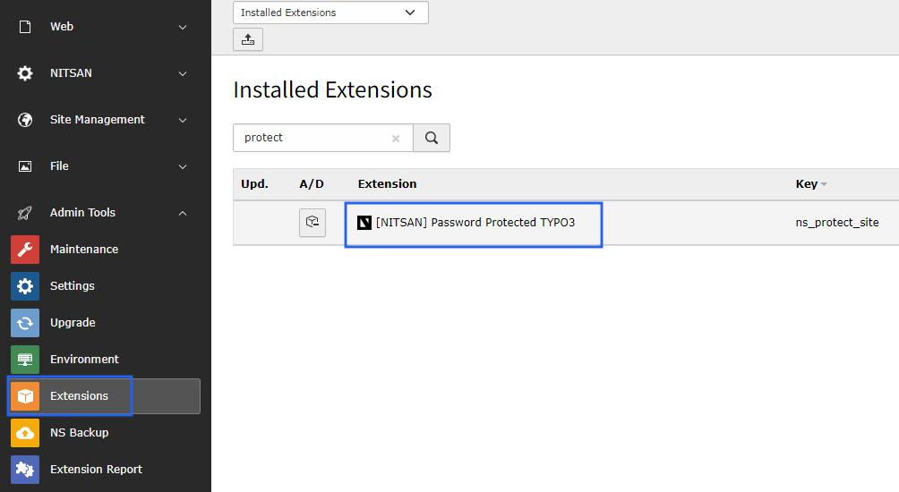
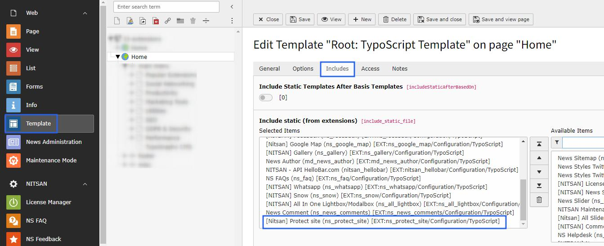

.. _installation:

============
Installation
============

Just install this extension the usual way like any other TYPO3 extension.

1. Get the extension
=====================

**Via Composer using Command Line**

::

    composer req explicatis/ns-protect-site --with-all-dependencies

**Via Extensions Module**

In the TYPO3 backend you can use the extension manager (EM).

Step 1. Switch to the module “Extension Manager”.

Step 2. Get the extension

Step 3. Get it from the Extension Manager: Press the “Retrieve/Update” button and search for the extension key ns_google_map and import the extension from the repository.

Step 4. Get it from typo3.org: You can always get the current version from https://extensions.typo3.org/extension/ns_protect_site/ by downloading either the t3x or zip version. Upload the file afterwards in the Extension Manager.

2. Activate the TypoScript
==========================

The extension ships some static TypoScript code which needs to be included.

Step 1. Switch to the root page of your site.

Step 2. Switch to the Template/TypoScript module and select Info/Modify.

Step 3. Click the link Edit the whole template record and switch to the tab Includes.

Step 4. Select [NITSAN] Google Map at the field Include static (from extensions):

Step 5. Include [NITSAN] Google Map at the last place.

How to Install TYPO3 Extension ns_protectsite
=============================================

**Extension Installation Via without Composer mode**
https://www.youtube.com/watch?v=SN5HoFQcDM4

**Extension Via Composer**
https://www.youtube.com/watch?v=_7ILu4lwU-k